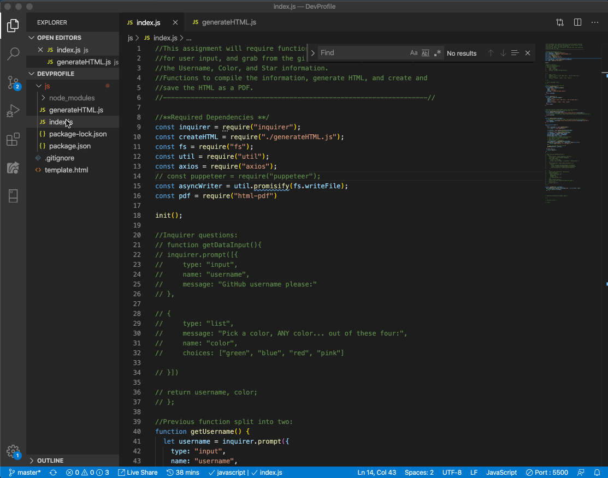

# Dev profile generator

## Contents

Using axios calls to the GitHub API we pull information into a js file, and then use that information in a pre-generated html to create a pdf of that html page. It's all pretty interesting.

When you run the application, this is the result: 

Here is a recording of the application in action!: 